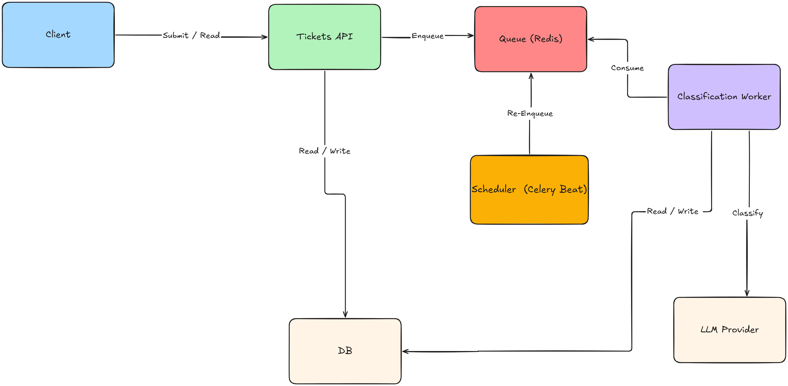

# Ticket Classification Service

Ingests support tickets and classifies them asynchronously with Claude



## Run

`SETUP: Add ANTHROPIC_API_KEY in .env`

```bash
cp .env.example .env
docker compose up -d --build
docker compose exec api python load_sample_tickets.py
```

API docs: <http://localhost:8000/docs> · Tests: `docker compose run --rm pytest`

Without `ANTHROPIC_API_KEY` every classification call fails, so all tickets end `failed` after 3 attempts.

## Decisions

- **Persistent storage:** Postgres. Survives restarts
- **Background processing:** Celery + Redis
- **Concurrency:** one worker with 2 processes (`-c 2`), so at most 2 classifications run at once.
- **Periodic retry:** Celery beat re-enqueues pending tickets every 10 minutes. 3 failed attempts → `failed`.
- **Invalid LLM output:** parsed as JSON and validated against fixed enums. Malformed output, unknown values, a refusal or a provider error count as one failed attempt.
- **Prompt injection:** the ticket is escaped and wrapped in tags marked as data; category and priority are limited to enums.

## API

| Method | Path                                             | Success                             | Errors                                                 |
| ------ | ------------------------------------------------ | ----------------------------------- | ------------------------------------------------------ |
| `POST` | `/tickets`                                       | 201 ticket, classification enqueued | 409 duplicate id (not re-classified), 422 invalid body |
| `GET`  | `/tickets/{id}`                                  | 200 ticket                          | 404                                                    |
| `GET`  | `/tickets?category=&priority=&offset=0&limit=20` | 200 `{total_count, result_list}`    | 422 invalid filter                                     |

- Create body: `{"id": "t-1001", "subject": "...", "body": "..."}`. `id` max 36 chars, `subject` optional
  (max 500), `body` required (max 20000).
- Ticket: `id, subject, body, status, category, priority, summary, failure_reason, created_at, updated_at,
last_classified_at`. `status` is `pending | classified | failed`; `category`, `priority`, `summary` are null
  until classified; `failure_reason` is always null for now.
- List: `category` and `priority` are optional and combine with AND; `limit` max 100; ordered by `created_at, id`.
- Errors: `{"detail": {"message": "...", "id": "..."}}` for 404/409, FastAPI's default `{"detail": [...]}` for 422.

## Weaknesses

- No tests for classification yet; only the ticket API is tested.
- The summary is not validated (one sentence is only requested in the prompt).
- No authentication. I assumed system-to-system use on private internal network not exposed publicly, but the API should still require a token.
- The LLM layer is loose: no base class for providers, and no LLM service to own provider selection and
  record every external call.
- Retries are capped at 100 tickets per 10 minutes, so a large backlog drains slowly.

## Things To Add Later

- Tests for the classify and periodic tasks, with the Claude client mocked.
- An LLM service with a base class for providers, recording every external call.
- Token authentication on the API.
- Validate the summary, and count an attempt before the LLM call.
- Re-classify failed tickets and tickets classified with an older prompt version.
